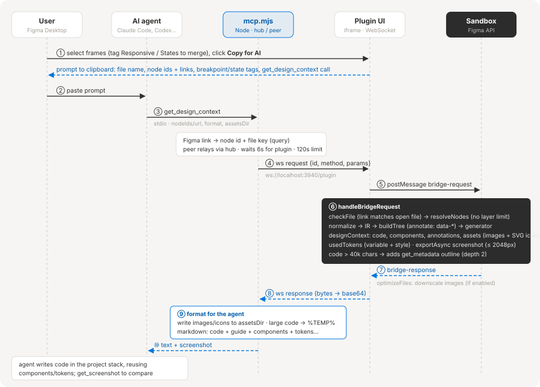

# GoApp Figma – Design to Code

**English** · [Tiếng Việt](README.vi.md)

A Figma plugin that turns the selected layers into **HTML + CSS**, **React + Tailwind (v4)** or **HTML + Tailwind**, plus an **MCP server** that lets Claude Code, Codex, Cursor… read the design and write code that fits your codebase.


- Works in both **Design mode** (plugin window with a live preview) and **Dev Mode** (Figma's native Code panel).
- **Export a runnable project**: a static site or a Next.js App Router app, images included.
- **Merge several frames into one page**: by breakpoint (Responsive) or by state (States).
- **MCP for AI agents**: click **Copy for AI** → paste into your agent → it reads the design over MCP and implements it.
- No network calls: everything runs inside Figma's sandbox (except Google Fonts for the preview and the MCP connection to `localhost`).

## Contents

- [Installation](#installation)
- [Usage](#usage)
- [Export project](#export-project)
- [Merging frames into one page](#merging-frames-into-one-page)
- [MCP for AI agents](#mcp-for-ai-agents-claude-code-codex-cursor)
- [Data flow: Figma → AI](#data-flow-figma--ai)
- [Architecture](#architecture)
- [Development](#development)
- [Current limitations](#current-limitations)

## Installation

```bash
git clone https://github.com/tuyndev18/go-figma.git
cd go-figma
npm install
npm run build        # or: npm run dev (watch)
```

In Figma Desktop: **Plugins → Development → Import plugin from manifest…** → pick `manifest.json`.

`npm run build` produces `dist/code.js` (sandbox), `dist/ui.html` (plugin window) and `dist/mcp.mjs` (MCP server).

## Usage

### Design mode

Run the plugin and select a frame. The code updates whenever the selection or the layers change.

| Area | What it does |
| --- | --- |
| Stack picker (top left) | HTML + CSS / React + Tailwind / HTML + Tailwind |
| ⚙ Code options | Code generation options, **Optimize images** |
| `MCP · n` | MCP server status and number of connected agents; click to open the management panel |
| Code tabs / **Preview** | View each generated file, or a live preview in an iframe |
| `≈ … tokens` | Estimated token count of the code (how much of an agent's context the selection takes) |
| Copy · Images · Export | Copy the code, download images as a zip, export the whole project |
| **Copy for AI** | Copy a prompt that has an agent read the selection over MCP |


### Dev Mode

Open the **Code** panel and pick "HTML + CSS" / "React + Tailwind" / "HTML + Tailwind".


## Export project

The **Export** button on the tab bar downloads `<frame-name>.zip`. Each selected frame becomes a page; the first frame is the home page.

| Target | Project |
| --- | --- |
| HTML + CSS | Static site: `index.html`, `<frame>.html`, a shared `styles.css`, `images/` |
| HTML + Tailwind | Static site using `@tailwindcss/browser@4` (CDN), `images/` |
| React + Tailwind | Next.js App Router: `app/page.jsx`, `app/<frame>/page.jsx`, Tailwind v4, `public/images/` |

Page and route names come from layer names, with Vietnamese diacritics stripped and converted to kebab-case.

## Merging frames into one page

With several frames selected, the **Pages** bar offers three modes:

| Mode | Result |
| --- | --- |
| **Separate** | Each frame is its own page (default). |
| **Responsive** | One page; each frame is a breakpoint (Mobile / Tablet / Desktop). |
| **States** | One page; each frame is a UI state or a step of a flow. |

Picking a mode tags every frame automatically: breakpoints are guessed from the frame name, falling back to its width; state names come from the part that differs between frame names. Each chip can then be adjusted. A frame left at None stays its own page. Tags are stored on the frame (plugin data), so they survive reopening and the MCP server reads them too.

Both merge modes match layers across frames by **tag + layer name** (text and icons also compare content). A layer present in only some frames is hidden (`display: none`) in the others. For clean markup, give layers the same name in every frame; differently named layers still render correctly but duplicate DOM, and the plugin warns about it.

Only one mode applies per merge; breakpoints × states cannot be combined.

### Responsive (one page – several breakpoints)

Select frames of the same screen at different sizes, choose **Responsive**, then check the Mobile / Tablet / Desktop tag of each frame.


The frames merge into **one** mobile-first page:

- The smallest frame provides the base styles. Larger frames only add what differs: `@media (min-width: 768px | 1024px)`, or `md:` / `lg:` with Tailwind.
- Flex children that change order between frames get `order`.
- The page root gets `width: 100%`; the frame height becomes `min-height`.
- The preview has a viewport switcher per breakpoint.

### States (one page – several states)

Select frames that are states of the same screen, choose **States**, then rename the states if needed. The first frame with a state (in selection order) is the **default** state.


- The default state provides the base styles. Every other state overrides only what differs from the default, never from the previous state. The page root carries `data-state="<state>"`.
- HTML + CSS: `.<root>[data-state="<state>"] .<class> { … }`.
- Tailwind: the root gets the `group` class; children use `group-data-[state=<state>]:…`, the root uses `data-[state=<state>]:…`.
- React: the component takes a `state` prop (defaulting to the default state). In the Next.js export, the page reads `?state=<state>` from the URL.
- Static site export: a small script reads `?state=<state>` from the URL.
- Frames keep their size; unlike Responsive, they are not turned into `width: 100%`.
- The preview has a state switcher.

## MCP for AI agents (Claude Code, Codex, Cursor…)

`dist/mcp.mjs` is a self-contained MCP server (stdio) that needs no `node_modules` at runtime. Agent calls a tool → server → WebSocket `localhost:3940` → plugin window → sandbox runs the plugin's own pipeline.


### Registering the server

The quickest way is the **MCP** panel inside the plugin (see below). Or register it from the command line (replace `<repo>` with the absolute path to this project):

```bash
# Claude Code
claude mcp add goapp-figma -- node <repo>/dist/mcp.mjs
# Codex
codex mcp add goapp-figma -- node <repo>/dist/mcp.mjs
```

Manual config – Codex `~/.codex/config.toml`:

```toml
[mcp_servers.goapp-figma]
command = "node"
args = ["<repo>/dist/mcp.mjs"]
```

Cursor / Claude Desktop / other clients use JSON: `{ "mcpServers": { "goapp-figma": { "command": "node", "args": ["<repo>/dist/mcp.mjs"] } } }`.

Then open the plugin in Figma Desktop (Design mode or Dev Mode inspect) and **keep the plugin window open**; a green **MCP** dot on the toolbar means it is connected.

### Managing agents from the plugin

Click **MCP** on the toolbar to open the management panel.


- **Connected agents**: agent sessions using GoApp Figma, their project folder, number of tool calls and the latest tool called. The number on `MCP · n` is the count of connected sessions. A yellow dot means the server is running but no agent uses it yet.
- **Agents**: add / remove / update the `goapp-figma` entry in each agent's user-level MCP config, without typing commands:

| Agent | Config file |
| --- | --- |
| Claude Code | `~/.claude.json` (`mcpServers`, user scope) |
| Codex | `~/.codex/config.toml` (`[mcp_servers.goapp-figma]`) |
| Cursor | `~/.cursor/mcp.json` |
| Claude Desktop | `%APPDATA%/Claude/claude_desktop_config.json` |
| VS Code (Copilot) | `%APPDATA%/Code/User/mcp.json` (`servers`) |
| Windsurf | `~/.codeium/windsurf/mcp_config.json` |
| Gemini CLI | `~/.gemini/settings.json` |

Only the `goapp-figma` entry is touched; the previous file is backed up as `<file>.goapp-figma.bak`. "Other path" means the entry points to a different `mcp.mjs`; click **Update** to point it at this one. JSONC files with comments (usually VS Code) are not rewritten, so the comments survive; use **Copy** and paste by hand instead. After a change, restart the agent (the panel says how for each one).

The plugin cannot read files on disk, so the MCP server process does this. If no agent is running the server yet, start a standalone hub for the panel to connect to:

```bash
npm run hub        # = node dist/mcp.mjs --hub, Ctrl+C to stop
```

This standalone hub serves no agent itself; agents started later connect through it, and if an agent already holds the port, the hub waits to take over when that agent exits.

### Tools

Modeled on Figma's official MCP server: instead of finished code, the tools return **context for the AI to understand the design's intent** and write code that fits the codebase.

| Tool | Purpose |
| --- | --- |
| `get_metadata` | Sparse XML outline (id, name, type, x/y/w/h, auto layout, component, text), no styling. Cheap; used to orient in large frames and pick sections. Nothing selected → pages + top-level layers |
| `get_design_context` | **Main tool.** Reference code (React + Tailwind by default) tagged with `data-node-id`, `data-name`, `data-component`, `data-props`, `data-annotation`; components used (variants, description, docs links), tokens in use, annotations, image/icon files written to disk (`assetsDir`), a screenshot and instructions for adapting it to the project's stack. Code > 40k chars → returns an outline so the agent works section by section |
| `get_variable_defs` | `scope: "selection"`: variables/styles in use (values in the layer's mode). `scope: "file"`: every local variable + a CSS `:root` block |
| `get_screenshot` | PNG/JPG image to look at or compare against (longest side ≤ 2048px) |
| `generate_code` | Plain code exactly like the Copy button (no hints); `imagesDir` writes images |
| `export_project` | Writes a whole runnable project to `outputDir` (never overwrites without `overwrite: true`) |

Every tool takes `nodeIds` (layer ids), or `url`, a Figma link (`…/design/<key>/<name>?node-id=<id>`, branch/proto links included). Empty = current selection. The link must belong to the file open in Figma; for another file the tool fails instead of reading a layer that happens to share the id. Oversized output is written to `%TEMP%/goapp-figma/` and the path is returned.

### Typical use

1. Select frames in Figma.
2. Click **Copy for AI** (the blue button in the plugin).
3. Paste into Claude Code / Codex. The prompt already contains the file name, layer ids (with links when the plugin can read the file key) and tells the agent to call `get_design_context` and follow its instructions.

You can also paste a Figma link straight into the chat, or use the `implement_design` prompt (Claude Code: `/mcp__goapp-figma__implement_design`).

Every element in the reference code carries `data-node-id`, `data-name`, `data-component`, `data-props`: the agent reads `data-component` / `data-props` to use the matching component already in the codebase instead of rebuilding it from raw tags.

### Notes

- Several agents can share one plugin: the first process holds the port as the hub, later processes relay requests through it; when the hub exits, another process takes over.
- After `npm run build`, the first process running the new build (a new agent, an `/mcp` reconnect, or `npm run hub`) is handed the port by the old hub; old processes become peers and the plugin reconnects after ~1.5s. No need to restart every agent.
- The server listens on `127.0.0.1`/`::1` only and rejects connections carrying a web page `Origin`, so websites cannot read the design.
- The connection is listed in the manifest's `devAllowedDomains`: it works when the plugin is imported for development, not in a published build.
- Dev Mode's Code panel (codegen) has no window, so it cannot connect to MCP.

## Data flow: Figma → AI



### Steps

1. **Plugin → clipboard.** **Copy for AI** builds a prompt with the file name, each frame (node id, a link when the file key is readable, breakpoint/state tag) and a `get_design_context` call with `nodeIds`, the `format` of the selected stack, and `assetsDir` set to the project's assets folder. For merged frames the prompt says whether it is a responsive page (md = 768px, lg = 1024px) or a page with states (and which one is the default).
2. **Agent → `mcp.mjs`** over stdio (MCP JSON-RPC). The server turns `url` into node ids + file key; links to several different files are rejected.
3. **`mcp.mjs` → plugin UI** over WebSocket `ws://localhost:3940/plugin`. A peer process relays the request through the hub. If the plugin is not connected, the hub waits 6s and then fails; every request has a 120s limit. Each call is counted for the MCP panel.
4. **Plugin UI → sandbox** via `postMessage`. The UI only relays; all Figma API work happens in the sandbox.
5. **Sandbox** runs the same pipeline as the plugin window (`src/plugin/bridge.ts`): check the link matches the open file → resolve nodes (selection or `nodeIds`; a link to a page → its top-level layers; at most 3000 layers) → `normalize` → IR → generator.
6. **Sandbox → UI → `mcp.mjs`.** The UI downscales images (when **Optimize images** is on) and sends the answer back; `Uint8Array`s travel as `{ "$bytes": "<base64>" }`.
7. **`mcp.mjs` → agent.** The server writes files to disk, saves large output to `%TEMP%/goapp-figma/`, and renders the result as markdown for the agent, with images attached.
8. **The agent** writes code in the project's stack and calls more tools as needed (outline → section by section, screenshot to compare).

### What the agent gets from `get_design_context`

| Part | Content |
| --- | --- |
| Reference code | Code in the requested `format` (React + Tailwind by default). Every element has `data-node-id`, `data-name`; component instances have `data-component`, `data-props`; designer notes become `data-annotation`; colors bound to variables become `var(--token, fallback)` |
| How to use this | Instructions for the agent: this is reference code, convert it to the project's stack, priority of the hints, drop `data-*` from the final code, never redraw icons |
| Components | Component name, instance count, variants in use, a few node ids, description + docs links, whether it comes from a team library |
| Design tokens | Variables (`--cssName`, value per mode, collection) and color / text / effect styles |
| Annotations | Designers' Dev Mode notes |
| Assets | Images and SVG icons written to `assetsDir`: path used in the code → file on disk |
| Conversion warnings | What the plugin could not convert (masks, blend modes…) |
| Screenshot | A PNG of each node |

When the code exceeds 40k characters it is not returned inline: the agent gets an XML outline (depth 2) to split by, and the full code is saved to a file.

### Tool chain per tool

Shared path: `nodeIds` / `url` → `query()` → `hub.request()` → WebSocket → plugin UI → sandbox `handleBridgeRequest()` → the tool's handler.

| Tool | In the sandbox (Figma) | In `mcp.mjs` (Node) | Agent receives |
| --- | --- | --- | --- |
| `get_metadata` | No selection and no `nodeIds` → `documentXml()` (pages + top-level layers). Otherwise `resolveNodes()` (no layer limit) → `metadataXml(depth)` | > 60k chars → written to a file | XML outline or a file path |
| `get_design_context` | `resolveNodes()` → `normalize()` (color variables always on, icons as SVG) → `designContext()` → `usedTokens()` → PNG screenshot; over 40k chars → adds `metadataXml(2)` | Writes assets to `assetsDir` (default `%TEMP%/goapp-figma/assets`), saves the code if too large, `designContextText()` | Markdown + images |
| `get_screenshot` | `resolveNodes()` → `exportAsync()` (scale 0.1–4, PNG/JPG, longest side ≤ 2048px) | Converts to base64 | Name + id + image per node |
| `get_variable_defs` | `selection`: `usedTokens()`; `file`: `localVariables()` | `file`: JSON + CSS `:root` block (> 60k → file) | Token list |
| `generate_code` | Plugin settings + parameters → `normalize()` → `generate()` (same as the Copy button) | > 60k chars → one file per section; with `imagesDir` → writes images | Code, image list, warnings |
| `export_project` | `normalize()` → `buildProject()` | `writeFiles(outputDir)`: refuses to write outside `outputDir`, never overwrites without `overwrite: true` | List of written files |

### Recommended call order

The server sends these instructions to the agent on connect:

1. Large frame or whole page: call `get_metadata` for a cheap outline and pick sections.
2. Call `get_design_context` per section, with `assetsDir` set to the project's assets folder.
3. Convert the reference code to the project's stack, reusing existing components and tokens.
4. Call `get_screenshot` to compare the result.

Use `generate_code` / `export_project` only when you want the plugin's code as-is.

### Common errors

| Error | Cause |
| --- | --- |
| Plugin is not connected | The plugin window is not open in Figma Desktop, or the plugin cannot reach `localhost:3940` |
| The link is for … | The Figma link belongs to a different file than the one open |
| Selection is too large | More than 3000 layers: use `get_metadata`, then call per section |
| Nothing is selected | No selection and no `nodeIds` / `url` passed |
| Figma did not answer … within 120s | The sandbox took too long, or the plugin window closed mid-request |

## Architecture


| File | Role |
| --- | --- |
| `src/core/normalize.ts` | The **only** module that calls the Figma API: position via `absoluteTransform`, auto layout, sizing, constraints, paints, text segments, variables, SVG export |
| `src/core/ir.ts` | IR types, no Figma dependency |
| `src/core/pageTags.ts` | Guesses breakpoints / state names for merged frames |
| `src/generators/css.ts` | Figma → CSS rules (flex, fill/hug, constraints, stroke → border/outline, effects…) |
| `src/generators/responsive.ts` | Merges several frames into one page (breakpoints or states) |
| `src/generators/tailwind.ts` | Translates CSS declarations → Tailwind classes; falls back to `[prop:value]` when no utility exists |
| `src/generators/htmlCss.ts` | Class names from layer names, shorthand merging |
| `src/generators/project.ts` | Builds the exported project (static site / Next.js) |
| `src/generators/designContext.ts` | Reference code for AI: `data-*` attributes, icons → asset files, collects components/annotations |
| `src/core/markup.ts` | HTML/JSX AST + printer (escaping, SVG → JSX) |
| `src/plugin/main.ts` | Sandbox: UI mode + codegen mode |
| `src/plugin/bridge.ts` | Sandbox: handles MCP requests (`metadata.ts` XML outline, `variables.ts` tokens) |
| `src/shared/bridge.ts` | MCP ⇄ plugin protocol (methods, params, results) |
| `src/ui/` | React UI (target picker, code, preview iframe, warnings, token estimate); `bridge.ts` holds the WebSocket to MCP; `McpPanel.tsx` is the agent management panel |
| `mcp/` | Node MCP server: `server.ts` defines the tools, `hub.ts` the WebSocket hub/peer + agent sessions, `agents.ts` each agent's config location, `agentConfig.ts` edits the `goapp-figma` entry in JSON/TOML |

Adding a framework: write a generator that takes `StyledElement[]` (or reads the IR directly); `normalize` stays untouched.

## Development

```bash
npm run dev         # build + watch
npm test            # vitest, tests generators with fake IR, no Figma needed
npm run typecheck   # plugin + MCP server
```

## Current limitations

- Image fills: code always references `images/<file>` (no base64 inlining); the images button on the tab bar downloads a zip. CROP mode exports as `cover`; image opacity/filters are not applied yet.
- **Optimize images** (on by default, in the ⚙ menu): each image file is scaled to 2× the largest size the design shows it at (never upscaled) and recompressed in the same format, so file names and code stay the same. Applies to image downloads, Export, and image files agents receive over MCP (`get_design_context`, `generate_code`, `export_project`). Turn it off to keep the originals.
- Masks and blend modes are not supported yet (a warning is shown).
- Grid auto layout and frames without auto layout → children are positioned `absolute` (following the layer's constraints).
- Tailwind output targets v4 (dynamic spacing scale, `outline-solid`, …).

## License

MIT
