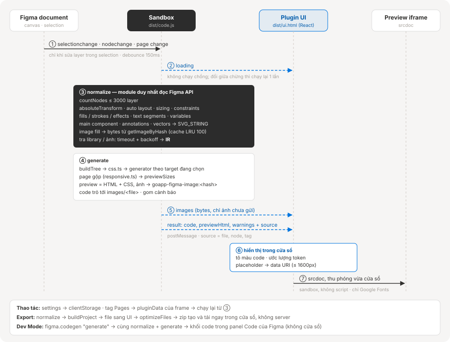
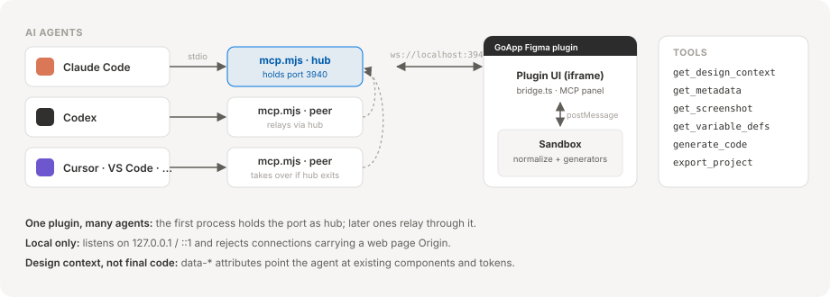
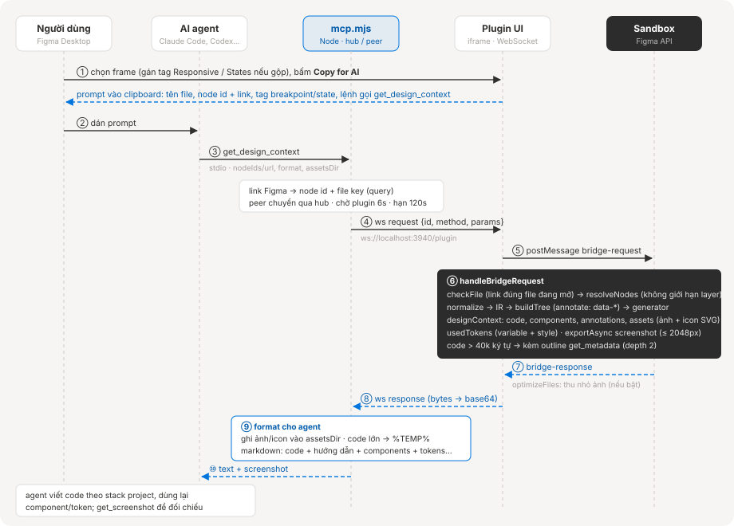
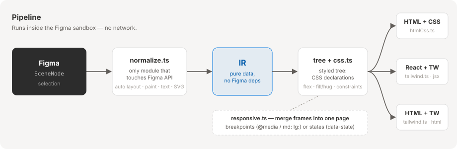

# GoApp Figma – Design to Code

[English](README.md) · **Tiếng Việt**

Plugin Figma chuyển layer đang chọn thành **HTML + CSS**, **React + Tailwind (v4)** hoặc **HTML + Tailwind**, kèm một **MCP server** để Claude Code, Codex, Cursor… đọc design và tự viết code theo codebase.

<!--  -->

- Chạy ở cả **Design mode** (cửa sổ plugin có preview) và **Dev Mode** (panel Code gốc của Figma).
- **Export project** chạy được: site tĩnh hoặc Next.js App Router, ảnh đi kèm.
- **Gộp nhiều frame thành 1 page**: theo breakpoint (Responsive) hoặc theo trạng thái (States).
- **MCP cho AI agent**: nút **Copy for AI** → dán vào agent → agent đọc design qua MCP rồi code.
- Không gọi mạng: mọi xử lý diễn ra trong sandbox của Figma (trừ font Google cho preview và kết nối MCP tới `localhost`).

## Mục lục

- [Cài đặt](#cài-đặt)
- [Sử dụng](#sử-dụng)
- [Export project](#export-project)
- [Gộp nhiều frame thành 1 page](#gộp-nhiều-frame-thành-1-page)
- [Luồng dữ liệu: Figma → UI plugin](#luồng-dữ-liệu-figma--ui-plugin-không-mạng)
- [MCP cho AI agent](#mcp-cho-ai-agent-claude-code-codex-cursor)
- [Luồng dữ liệu: Figma → AI](#luồng-dữ-liệu-figma--ai)
- [Kiến trúc](#kiến-trúc)
- [Phát triển](#phát-triển)
- [Giới hạn hiện tại](#giới-hạn-hiện-tại)

## Cài đặt

```bash
git clone https://github.com/tuyndev18/go-figma.git
cd go-figma
npm install
npm run build        # hoặc: npm run dev (watch)
```

Trong Figma Desktop: **Plugins → Development → Import plugin from manifest…** → chọn `manifest.json`.

`npm run build` sinh ra `dist/code.js` (sandbox), `dist/ui.html` (cửa sổ plugin) và `dist/mcp.mjs` (MCP server).

## Sử dụng

### Design mode

Chạy plugin, chọn một frame. Code tự cập nhật khi đổi selection hoặc sửa layer.

| Vùng | Chức năng |
| --- | --- |
| Ô chọn stack (góc trái) | HTML + CSS / React + Tailwind / HTML + Tailwind |
| ⚙ Code options | Tuỳ chọn sinh code, **Optimize images** |
| `MCP · n` | Trạng thái MCP server và số agent đang nối; bấm để mở panel quản lý |
| Tab code / **Preview** | Xem code từng file hoặc preview thật trong iframe |
| `≈ … tokens` | Ước lượng số token của code (để biết selection chiếm bao nhiêu context của agent) |
| Copy · Tải ảnh · Export | Copy code, tải ảnh dạng zip, export cả project |
| **Copy for AI** | Copy prompt cho agent đọc selection qua MCP |

<!--  -->

### Dev Mode

Mở panel **Code**, chọn ngôn ngữ "HTML + CSS" / "React + Tailwind" / "HTML + Tailwind".

<!--  -->

## Export project

Nút **Export** trên thanh tab tải về `<tên-frame>.zip`. Mỗi frame đang chọn thành một page, frame đầu tiên là trang chủ.

| Target | Project |
| --- | --- |
| HTML + CSS | Site tĩnh: `index.html`, `<frame>.html`, `styles.css` dùng chung, `images/` |
| HTML + Tailwind | Site tĩnh dùng `@tailwindcss/browser@4` (CDN), `images/` |
| React + Tailwind | Next.js App Router: `app/page.jsx`, `app/<frame>/page.jsx`, Tailwind v4, `public/images/` |

Tên page/route lấy từ tên layer, bỏ dấu tiếng Việt và chuyển thành kebab-case.

## Gộp nhiều frame thành 1 page

Khi chọn nhiều frame, thanh **Pages** có 3 chế độ:

| Chế độ | Kết quả |
| --- | --- |
| **Separate** | Mỗi frame là một page riêng (mặc định). |
| **Responsive** | Một page, mỗi frame là một breakpoint (Mobile / Tablet / Desktop). |
| **States** | Một page, mỗi frame là một trạng thái UI hoặc một bước của flow. |

Khi chọn chế độ, plugin tự gán tag cho từng frame: breakpoint đoán theo tên frame, nếu không có thì theo chiều rộng; tên state lấy phần khác nhau giữa các tên frame. Sau đó có thể sửa từng chip. Frame để trống (None) vẫn là page riêng. Tag được lưu vào frame (plugin data), nên lần sau mở lại và MCP server đều đọc được.

Cả hai chế độ gộp ghép layer giữa các frame theo **tag + tên layer** (text/icon so thêm nội dung). Layer chỉ có ở một số frame sẽ bị ẩn (`display: none`) ở các frame còn lại. Muốn markup gọn thì đặt tên layer giống nhau ở mọi frame; tên khác nhau vẫn ra đúng giao diện nhưng bị lặp DOM, và plugin sẽ cảnh báo.

Chỉ một trong hai chế độ được dùng cho một lần gộp, không kết hợp breakpoint × state.

### Responsive (1 page – nhiều breakpoint)

Chọn các frame của cùng một màn ở các kích thước khác nhau, chọn **Responsive** rồi kiểm tra Mobile / Tablet / Desktop của mỗi frame.

<!--  -->

Các frame gộp thành **một** page, viết theo kiểu mobile-first:

- Frame nhỏ nhất làm style gốc. Frame lớn hơn chỉ thêm phần khác biệt: `@media (min-width: 768px | 1024px)`, hoặc `md:` / `lg:` với Tailwind.
- Con của flex bị đổi thứ tự giữa các frame được thêm `order`.
- Root của page có `width: 100%`, chiều cao frame chuyển thành `min-height`.
- Preview có nút chuyển viewport theo từng breakpoint.

### States (1 page – nhiều trạng thái)

Chọn các frame là các trạng thái của cùng một màn, chọn **States** rồi sửa tên state nếu cần. Frame có state đầu tiên (theo thứ tự chọn) là trạng thái **default**.

<!--  -->

- State default làm style gốc. Mỗi state khác chỉ override phần khác so với default, không so với state trước nó. Root của page có `data-state="<state>"`.
- HTML + CSS: `.<root>[data-state="<state>"] .<class> { … }`.
- Tailwind: root có class `group`, con dùng `group-data-[state=<state>]:…`, root dùng `data-[state=<state>]:…`.
- React: component nhận prop `state` (mặc định là state default). Trong Next.js export, page đọc `?state=<state>` từ URL.
- Site tĩnh export: có một script nhỏ đọc `?state=<state>` từ URL.
- Frame giữ nguyên kích thước, không chuyển thành `width: 100%` như Responsive.
- Preview có nút chuyển giữa các state.

## Luồng dữ liệu: Figma → UI plugin (không mạng)



Cửa sổ plugin không gọi server nào. Dữ liệu Figma được đọc và chuyển thành code trong sandbox, rồi gửi sang cửa sổ bằng `postMessage`. Cửa sổ là một file tĩnh duy nhất, `dist/ui.html`, bundle React được nhúng thẳng vào vì Figma chỉ nhận một file HTML. Khi chạy, nó không tải gì ngoài Google Fonts cho preview.

### Các bước

1. **Kích hoạt.** `selectionchange`, `nodechange` trên page hiện tại (chỉ khi sửa layer nằm trong selection; layer tạm plugin tạo lúc export bị bỏ qua), `currentpagechange`, đổi settings hoặc tag Pages. Debounce 150ms, không bao giờ chạy chồng: có thay đổi trong lúc đang chạy thì chạy thêm một lần sau đó và bỏ kết quả cũ.
2. **Kiểm tra kích thước.** Sandbox đếm layer (tối đa 3000, quá thì báo lỗi) và gửi `loading`.
3. **`normalize`**, module duy nhất đọc Figma API: vị trí từ `absoluteTransform`, auto layout, sizing, constraints, fill / stroke / effect, text segment, variable, main component, annotation, vector export thành `SVG_STRING`, bytes ảnh từ `getImageByHash`. Figma có thể tải component library và bytes ảnh qua kết nối riêng của nó, nên các lần tra này có timeout (library 4s, ảnh 15s) và bị bỏ qua 60s sau khi lỗi, để Figma mất mạng không làm treo lần chạy. Bytes ảnh được cache giữa các lần chạy (100 ảnh gần nhất). Kết quả: **IR**, dữ liệu thuần không phụ thuộc Figma.
4. **`generate`.** IR → styled tree (`css.ts`) → generator theo target đang chọn. Preview riêng luôn là HTML + CSS, ảnh trỏ tới placeholder `goapp-figma-image:<hash>`. Page gộp có một kích thước preview cho mỗi breakpoint hoặc state.
5. **Sandbox → UI.** Message `images` mang bytes của ảnh cửa sổ chưa có (mỗi ảnh gửi một lần mỗi phiên), sau đó `result` mang các section code, `previewHtml`, kích thước preview, cảnh báo và tham chiếu ảnh, kèm `source` (tên file, frame, tag) cho thanh Pages và **Copy for AI**.
6. **UI.** Tô màu code, ước lượng token, thay placeholder bằng data URI (ảnh trên 256 KB được thu về ≤ 1600px). Preview cũ giữ nguyên tới khi preview mới sẵn sàng.
7. **Preview iframe.** `srcdoc` với `sandbox="allow-same-origin"` (không chạy script), thu phóng vừa cửa sổ, có nút chuyển viewport / state cho page gộp.

### Các luồng khác

| Thao tác | Luồng |
| --- | --- |
| Export | Sandbox: `normalize` → `buildProject` → message `project` → UI: `optimizeFiles` → zip tạo ngay trong cửa sổ rồi tải về |
| Tải ảnh | UI: zip bytes ảnh cửa sổ đang giữ (sau `optimizeFiles`) |
| Settings | Lưu vào `figma.clientStorage`, rồi chạy lại |
| Tag Pages | Lưu thành `pluginData` trên từng frame, rồi chạy lại |
| Dev Mode | `figma.codegen.on("generate")` → cùng `normalize` + `generate` → khối code trong panel Code của Figma; không cửa sổ, không preview |

## MCP cho AI agent (Claude Code, Codex, Cursor…)

`dist/mcp.mjs` là MCP server (stdio) tự chứa, không cần `node_modules` khi chạy. Agent gọi tool → server → WebSocket `localhost:3940` → cửa sổ plugin → sandbox chạy đúng pipeline của plugin.



### Đăng ký server

Cách nhanh nhất là dùng panel **MCP** trong plugin (xem bên dưới). Hoặc đăng ký bằng lệnh (đổi `<repo>` thành đường dẫn tuyệt đối tới thư mục project):

```bash
# Claude Code
claude mcp add goapp-figma -- node <repo>/dist/mcp.mjs
# Codex
codex mcp add goapp-figma -- node <repo>/dist/mcp.mjs
```

Cấu hình tay – Codex `~/.codex/config.toml`:

```toml
[mcp_servers.goapp-figma]
command = "node"
args = ["<repo>/dist/mcp.mjs"]
```

Cursor / Claude Desktop / client khác dùng JSON: `{ "mcpServers": { "goapp-figma": { "command": "node", "args": ["<repo>/dist/mcp.mjs"] } } }`.

Sau đó mở plugin trong Figma Desktop (Design mode hoặc Dev Mode inspect) và **giữ cửa sổ plugin mở**; chấm **MCP** trên toolbar xanh là đã nối.

### Quản lý agent ngay trong plugin

Bấm nút **MCP** trên toolbar để mở panel quản lý.

<!--  -->

- **Connected agents**: các phiên agent đang dùng GoApp Figma, thư mục project, số lần gọi tool và tool gọi gần nhất. Số trên nút `MCP · n` là số phiên đang nối. Chấm vàng = server đang chạy nhưng chưa agent nào dùng.
- **Agents**: thêm / gỡ / cập nhật entry `goapp-figma` trong config MCP cấp user của từng agent, không cần gõ lệnh:

| Agent | File config |
| --- | --- |
| Claude Code | `~/.claude.json` (`mcpServers`, scope user) |
| Codex | `~/.codex/config.toml` (`[mcp_servers.goapp-figma]`) |
| Cursor | `~/.cursor/mcp.json` |
| Claude Desktop | `%APPDATA%/Claude/claude_desktop_config.json` |
| VS Code (Copilot) | `%APPDATA%/Code/User/mcp.json` (`servers`) |
| Windsurf | `~/.codeium/windsurf/mcp_config.json` |
| Gemini CLI | `~/.gemini/settings.json` |

Chỉ entry `goapp-figma` bị đụng tới; file cũ được sao lưu thành `<file>.goapp-figma.bak`. "Other path" nghĩa là entry đang trỏ tới bản `mcp.mjs` khác, bấm **Update** để trỏ về bản này. File JSONC có comment (thường là VS Code) không bị ghi đè để khỏi mất comment, khi đó dùng **Copy** và dán tay. Sau khi đổi, khởi động lại agent (panel ghi cách cho từng agent).

Plugin không đọc được file trên máy, nên việc này do process MCP server làm. Chưa có agent nào chạy server thì chạy riêng hub để panel có chỗ nối:

```bash
npm run hub        # = node dist/mcp.mjs --hub, Ctrl+C để dừng
```

Hub riêng này không phục vụ agent nào; agent mở sau sẽ nối qua nó, và nếu một agent đang giữ port thì hub chờ để tiếp quản khi agent đó thoát.

### Tool

Theo mô hình MCP chính thức của Figma: không đưa code thành phẩm mà đưa **ngữ cảnh để AI hiểu ý design** rồi tự viết theo codebase.

| Tool | Việc |
| --- | --- |
| `get_metadata` | Outline XML thưa (id, tên, type, x/y/w/h, auto layout, component, text), không style. Rẻ, dùng để định hướng frame lớn và chọn section. Không chọn gì → danh sách page + layer cấp 1 |
| `get_design_context` | **Tool chính.** Code tham chiếu (mặc định React + Tailwind) gắn `data-node-id`, `data-name`, `data-component`, `data-props`, `data-annotation`; danh sách component (variant, mô tả, link docs), token đang dùng, annotation, file ảnh/icon đã ghi ra đĩa (`assetsDir`), screenshot và chỉ dẫn cách chuyển sang stack của project. Code > 40k ký tự → trả outline để agent làm từng section |
| `get_variable_defs` | `scope: "selection"`: variable/style đang dùng (giá trị theo mode của layer). `scope: "file"`: mọi variable local + khối CSS `:root` |
| `get_screenshot` | Ảnh PNG/JPG để nhìn/đối chiếu (cạnh dài ≤ 2048px) |
| `generate_code` | Code thuần y như nút Copy (không gợi ý); `imagesDir` ghi ảnh |
| `export_project` | Ghi cả project chạy được ra `outputDir` (không ghi đè nếu không có `overwrite: true`) |

Mọi tool nhận `nodeIds` (id layer), hoặc `url` là link Figma (`…/design/<key>/<tên>?node-id=<id>`, cả link branch/proto). Bỏ trống = selection hiện tại. Link phải thuộc file đang mở trong Figma; khác file thì tool báo lỗi thay vì đọc nhầm layer trùng id. Output quá lớn được ghi ra `%TEMP%/goapp-figma/` và trả đường dẫn.

### Cách dùng chính

1. Chọn frame trong Figma.
2. Bấm **Copy for AI** (nút xanh trong plugin).
3. Dán vào Claude Code / Codex. Prompt đã có tên file, id layer (kèm link nếu plugin đọc được file key) và bảo agent gọi `get_design_context` rồi làm theo chỉ dẫn.

Cũng có thể dán thẳng link Figma vào chat, hoặc dùng prompt `implement_design` (Claude Code: `/mcp__goapp-figma__implement_design`).

Mỗi phần tử trong code tham chiếu mang `data-node-id`, `data-name`, `data-component`, `data-props`: agent đọc `data-component` / `data-props` để dùng component có sẵn trong codebase thay vì dựng lại từ thẻ thô.

### Ghi chú

- Nhiều agent chạy cùng lúc dùng chung một plugin: process đầu giữ port làm hub, các process sau chuyển request qua hub; hub thoát thì process khác tự tiếp quản.
- Sau khi `npm run build`, process đầu tiên chạy bản mới (agent mới mở, `/mcp` reconnect, hoặc `npm run hub`) sẽ được hub bản cũ nhường port; các process cũ chuyển thành peer, plugin tự nối lại sau ~1.5s. Không cần khởi động lại mọi agent.
- Server chỉ nghe `127.0.0.1`/`::1`, từ chối kết nối có `Origin` của trang web, nên trang web không đọc được design.
- Kết nối nằm trong `devAllowedDomains` của manifest: chạy được khi import plugin dạng development, không chạy ở bản publish.
- Panel Code của Dev Mode (codegen) không có cửa sổ nên không nối MCP được.

## Luồng dữ liệu: Figma → AI



### Các bước

1. **Plugin → clipboard.** **Copy for AI** tạo prompt gồm tên file, từng frame (node id, link nếu đọc được file key, tag breakpoint/state) và lệnh gọi `get_design_context` với `nodeIds`, `format` theo stack đang chọn, `assetsDir` là thư mục asset của project. Nếu các frame được gộp, prompt nói rõ đó là page responsive (md = 768px, lg = 1024px) hay page nhiều state (state nào là default).
2. **Agent → `mcp.mjs`** qua stdio (JSON-RPC của MCP). Server đổi `url` thành node id + file key; các link thuộc nhiều file khác nhau bị từ chối.
3. **`mcp.mjs` → plugin UI** qua WebSocket `ws://localhost:3940/plugin`. Process là peer thì chuyển request qua hub. Plugin chưa nối thì hub chờ 6s rồi báo lỗi; mỗi request có hạn 120s. Mỗi lần gọi được đếm để hiện trong panel MCP.
4. **Plugin UI → sandbox** qua `postMessage`. UI chỉ chuyển tiếp, mọi việc với Figma API làm trong sandbox.
5. **Sandbox** chạy cùng pipeline với cửa sổ plugin (`src/plugin/bridge.ts`): kiểm tra link đúng file đang mở → lấy node (selection hoặc `nodeIds`; link tới page → các layer cấp 1; tối đa 3000 layer) → `normalize` → IR → generator.
6. **Sandbox → UI → `mcp.mjs`.** UI thu nhỏ ảnh (nếu bật **Optimize images**) rồi gửi lại; `Uint8Array` đi dạng `{ "$bytes": "<base64>" }`.
7. **`mcp.mjs` → agent.** Server ghi file ra đĩa, lưu output lớn ra `%TEMP%/goapp-figma/`, viết kết quả thành markdown cho agent đọc, kèm ảnh.
8. **Agent** viết code theo stack của project và gọi tiếp tool khi cần (outline → từng section, screenshot để đối chiếu).

### Agent nhận gì từ `get_design_context`

| Phần | Nội dung |
| --- | --- |
| Reference code | Code theo `format` (mặc định React + Tailwind). Mỗi phần tử có `data-node-id`, `data-name`; instance của component có `data-component`, `data-props`; ghi chú designer thành `data-annotation`; màu gắn variable thành `var(--token, fallback)` |
| How to use this | Hướng dẫn cho agent: đây là code tham chiếu, chuyển sang stack của project, thứ tự ưu tiên các gợi ý, bỏ `data-*` khỏi code cuối, không vẽ lại icon |
| Components | Tên component, số instance, variant đang dùng, vài node id, mô tả + link docs, có từ team library không |
| Design tokens | Variable (`--cssName`, giá trị theo mode, collection) và style màu / chữ / effect |
| Annotations | Ghi chú Dev Mode của designer |
| Assets | Ảnh và icon SVG đã ghi vào `assetsDir`: đường dẫn trong code → file trên đĩa |
| Conversion warnings | Phần plugin chưa chuyển được (mask, blend mode…) |
| Screenshot | Ảnh PNG của từng node |

Code quá 40k ký tự thì không trả inline: agent nhận outline XML (depth 2) để chia section, code đầy đủ được lưu ra file.

### Toolchain từng tool

Phần chung: `nodeIds` / `url` → `query()` → `hub.request()` → WebSocket → plugin UI → sandbox `handleBridgeRequest()` → handler của tool.

| Tool | Trong sandbox (Figma) | Trong `mcp.mjs` (Node) | Agent nhận |
| --- | --- | --- | --- |
| `get_metadata` | Không có selection và `nodeIds` → `documentXml()` (page + layer cấp 1). Ngược lại `resolveNodes()` (không giới hạn layer) → `metadataXml(depth)` | > 60k ký tự → ghi file | XML outline hoặc đường dẫn file |
| `get_design_context` | `resolveNodes()` → `normalize()` (luôn bật variable màu, icon thành SVG) → `designContext()` → `usedTokens()` → screenshot PNG; quá 40k ký tự → thêm `metadataXml(2)` | Ghi asset vào `assetsDir` (mặc định `%TEMP%/goapp-figma/assets`), lưu code nếu quá lớn, `designContextText()` | Markdown + ảnh |
| `get_screenshot` | `resolveNodes()` → `exportAsync()` (scale 0.1–4, PNG/JPG, cạnh dài ≤ 2048px) | Chuyển sang base64 | Tên + id + ảnh từng node |
| `get_variable_defs` | `selection`: `usedTokens()`; `file`: `localVariables()` | `file`: JSON + khối CSS `:root` (> 60k → ghi file) | Danh sách token |
| `generate_code` | Settings của plugin + tham số → `normalize()` → `generate()` (giống nút Copy) | > 60k ký tự → ghi file từng section; có `imagesDir` → ghi ảnh | Code, danh sách ảnh, cảnh báo |
| `export_project` | `normalize()` → `buildProject()` | `writeFiles(outputDir)`: chặn ghi ra ngoài `outputDir`, không ghi đè nếu thiếu `overwrite: true` | Danh sách file đã ghi |

### Thứ tự gọi khuyến nghị

Server gửi kèm hướng dẫn này cho agent khi kết nối:

1. Frame lớn hoặc cả page: gọi `get_metadata` lấy outline rẻ, chọn section.
2. Gọi `get_design_context` cho từng section, `assetsDir` là thư mục asset của project.
3. Chuyển code tham chiếu sang stack của project, dùng lại component và token có sẵn.
4. Gọi `get_screenshot` để đối chiếu kết quả.

`generate_code` / `export_project` chỉ dùng khi cần code của plugin nguyên trạng.

### Lỗi thường gặp

| Lỗi | Nguyên nhân |
| --- | --- |
| Plugin is not connected | Cửa sổ plugin chưa mở trong Figma Desktop, hoặc plugin không nối được `localhost:3940` |
| The link is for … | Link Figma thuộc file khác file đang mở |
| Selection is too large | Quá 3000 layer: dùng `get_metadata` rồi gọi từng section |
| Nothing is selected | Không có selection và không truyền `nodeIds` / `url` |
| Figma did not answer … within 120s | Sandbox xử lý quá lâu hoặc cửa sổ plugin bị đóng giữa chừng |

## Kiến trúc



| File | Vai trò |
| --- | --- |
| `src/core/normalize.ts` | Module **duy nhất** gọi Figma API: vị trí qua `absoluteTransform`, auto layout, sizing, constraints, paint, text segment, variable, SVG export |
| `src/core/ir.ts` | Kiểu IR, không phụ thuộc Figma |
| `src/core/pageTags.ts` | Đoán breakpoint / tên state cho các frame được gộp |
| `src/generators/css.ts` | Luật Figma → CSS (flex, fill/hug, constraints, stroke → border/outline, effect…) |
| `src/generators/responsive.ts` | Gộp nhiều frame thành 1 page (breakpoint hoặc state) |
| `src/generators/tailwind.ts` | Dịch khai báo CSS → class Tailwind; không có utility thì fallback `[prop:value]` |
| `src/generators/htmlCss.ts` | Đặt tên class từ tên layer, gộp shorthand |
| `src/generators/project.ts` | Dựng project export (site tĩnh / Next.js) |
| `src/generators/designContext.ts` | Code tham chiếu cho AI: thuộc tính `data-*`, icon → file asset, gom component/annotation |
| `src/core/markup.ts` | AST + printer HTML/JSX (escape, SVG → JSX) |
| `src/plugin/main.ts` | Sandbox: UI mode + codegen mode |
| `src/plugin/bridge.ts` | Sandbox: xử lý request từ MCP (`metadata.ts` outline XML, `variables.ts` token) |
| `src/shared/bridge.ts` | Protocol MCP ⇄ plugin (method, params, kết quả) |
| `src/ui/` | UI React (chọn target, code, preview iframe, cảnh báo, ước lượng token); `bridge.ts` giữ WebSocket tới MCP; `McpPanel.tsx` panel quản lý agent |
| `mcp/` | MCP server Node: `server.ts` định nghĩa tool, `hub.ts` WebSocket hub/peer + danh sách phiên agent, `agents.ts` vị trí config từng agent, `agentConfig.ts` sửa entry `goapp-figma` trong JSON/TOML |

Thêm framework mới: viết một generator nhận `StyledElement[]` (hoặc đọc thẳng IR), không cần đụng vào `normalize`.

## Phát triển

```bash
npm run dev         # build + watch
npm test            # vitest, test generator bằng IR giả, không cần Figma
npm run typecheck   # plugin + MCP server
```

## Giới hạn hiện tại

- Image fill: code luôn tham chiếu file `images/<file>` (không nhúng base64); nút tải ảnh trên thanh tab tải zip. Chế độ CROP xuất thành `cover`, chưa áp opacity/filter của ảnh.
- **Optimize images** (bật mặc định, trong menu ⚙): mỗi file ảnh được thu về 2× kích thước lớn nhất mà design hiển thị nó (không phóng to), nén lại cùng định dạng nên tên file và code không đổi. Áp dụng cho tải ảnh, Export và file ảnh agent nhận qua MCP (`get_design_context`, `generate_code`, `export_project`). Tắt đi để giữ ảnh gốc.
- Mask, blend mode chưa hỗ trợ (sẽ hiện cảnh báo).
- Grid auto layout và frame không có auto layout → con được định vị `absolute` (theo constraints của layer).
- Tailwind output nhắm v4 (thang spacing động, `outline-solid`, …).

## License

MIT
